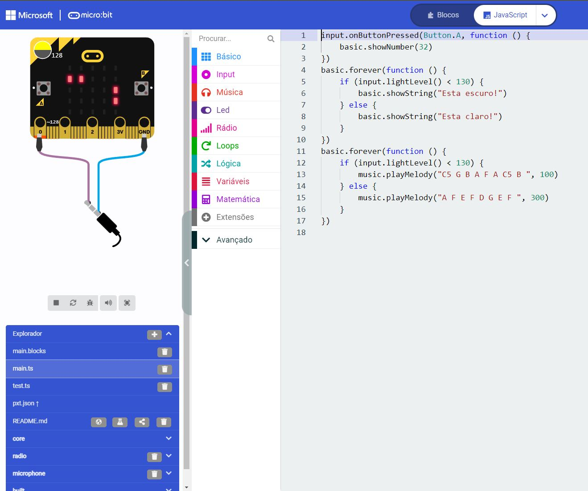
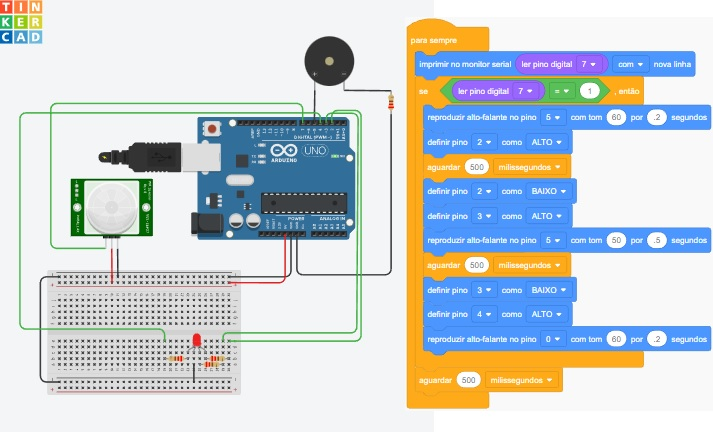

# IoT_edge_computing
Microbit_Arduino

<h3>1) Microbit<h3>
Projeto com sensor de iluminação que descreve na placa luminosa qual é a situação do ambiente: "Está claro" ou "Está escuro", dependendo de cada situação, uma música é tocada.
  
  <a href="https://github.com/bermudevs/myfirst">Clique aqui para o projeto</a>

<h3>2) PiscaPisca<h3>
Projeto Pisca Pisca: Alteração que eu fiz referente a aula foi a intermitência entre um led e outro, eles não piscam simultaneamente.

<a href="PiscaPisca.ino">Clique aqui para o código C++</a>
 
<a href="PiscaPisca.brd">Clique aqui para abrir o .brd para usar no https://www.tinkercad.com</a>
  

<h3>2) PiscaPisca<h3>
Projeto Pisca Pisca: Alteração que eu fiz referente a aula foi a intermitência entre um led e outro, eles não piscam simultaneamente.

<a href="PiscaPisca.ino">Clique aqui para o código C++</a>
 
<a href="PiscaPisca.brd">Clique aqui para abrir o .brd para usar no https://www.tinkercad.com</a>
  

<h3>4) Sensor Movimento<h3>
Projeto Sensor de Movimento: Alteração que fiz foi implementar um LED que não foi dado em aula alguma mas pela noção dada em aulas dos LEDs simples, foi possível entender como funciona todo o sistema e fazer funcionar a minha ideia! 

 
<a href="sensor_presenca_buzzer_rgb1.ino">Clique aqui para o código C++</a>
 
<a href="Sensor_presenca_Buzzer.brd">Clique aqui para abrir o .brd para usar no https://www.tinkercad.com</a>
